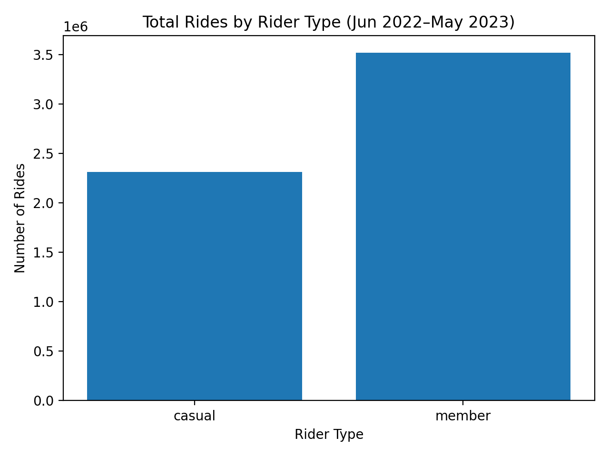
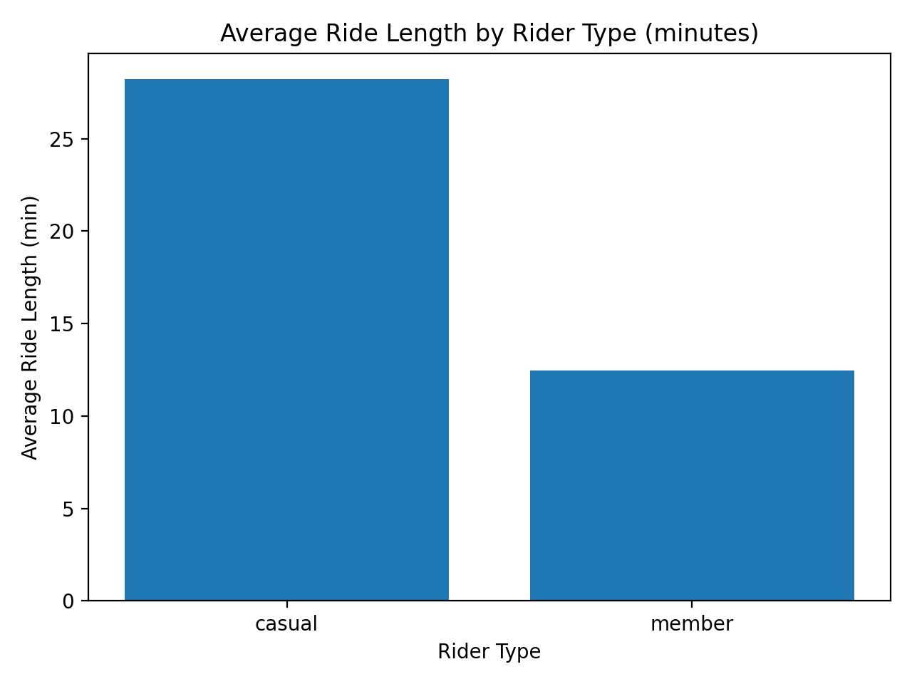
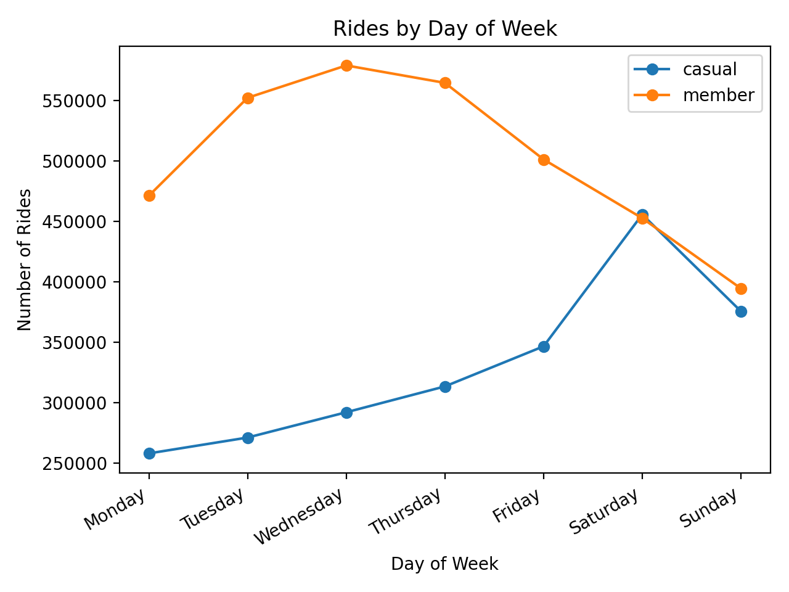
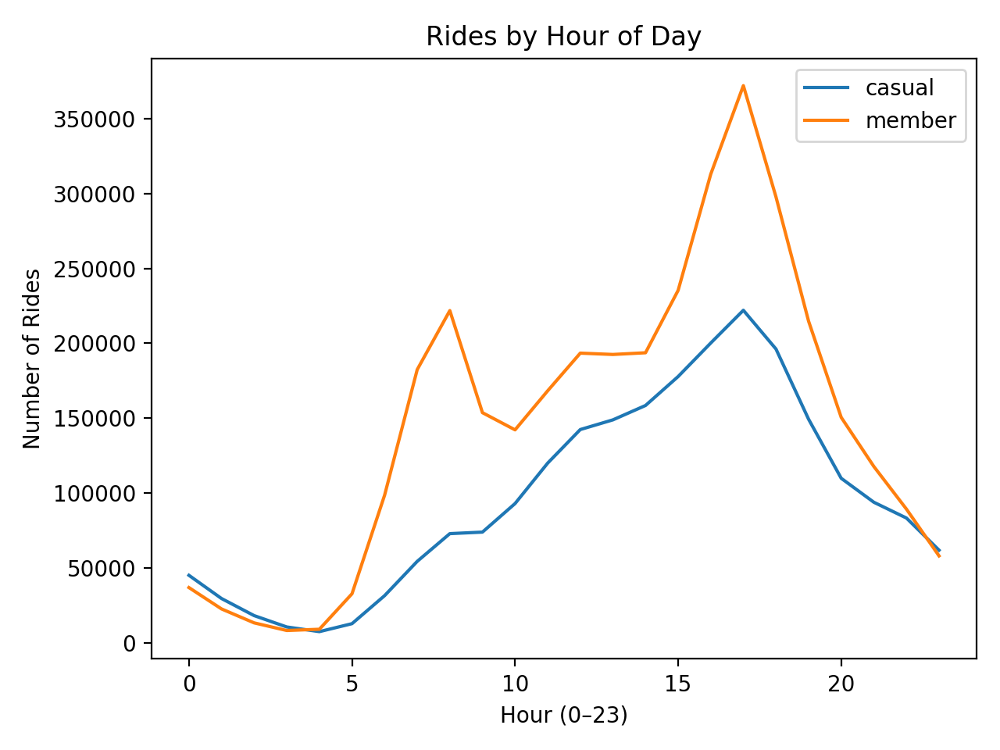
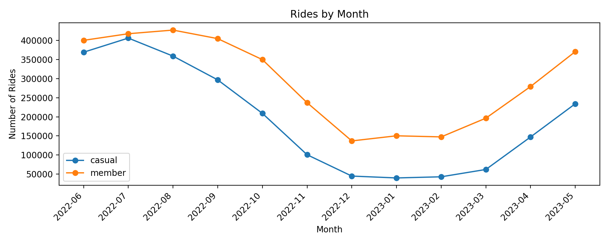
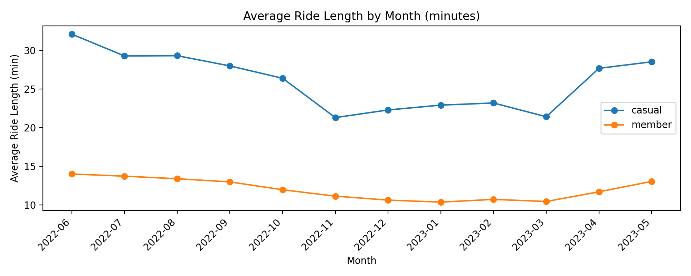

# Cyclistic Bike-Share Analysis
### How Annual Members and Casual Riders Use Bikes Differently

## Project Overview
This project is an end-to-end data analytics case study conducted as part of the Google Data Analytics Certificate. The analysis explores how casual riders and annual members use Cyclistic’s bike-share service differently, with the goal of identifying insights that can inform marketing strategies to increase annual memberships.

## Business Task
Analyze Cyclistic’s historical bike-share trip data to identify behavioral differences between casual riders and annual members, then provide data-driven recommendations that support converting casual riders into annual members.

## Stakeholders
- Cyclistic Executive Team
- Marketing Analytics Team

## Dataset
- Source: Publicly available Divvy (Cyclistic) bike-share trip data
- Timeframe: June 2022 – May 2023 (12 consecutive months)
- Format: Monthly CSV files

> Raw data files are not stored in this repository due to file size constraints. Data source links and documentation are provided in the `/references` and `/data` folders.

## Analysis Process
The analysis follows the six phases of the data analysis process:

1. **Ask** – Defined the business problem and success criteria  
2. **Prepare** – Identified and validated relevant public datasets  
3. **Process** – Cleaned and transformed data for analysis  
4. **Analyze** – Explored usage patterns and behavioral differences  
5. **Share** – Created visualizations and summarized key findings  
6. **Act** – Developed actionable marketing recommendations  
## Key Findings (Preliminary)

The following insights are based on exploratory analysis of Cyclistic bike-share trip data from June 2022 through May 2023. These findings describe observed behavioral patterns and will be used to inform business recommendations.

### Rider Type Usage
- Annual members account for a higher overall number of rides compared to casual riders.
- Casual riders, while fewer in total trips, tend to take longer rides on average.

### Ride Duration
- Casual riders consistently exhibit longer average ride lengths than annual members.
- This pattern suggests different usage motivations between rider types, such as leisure versus routine transportation.

### Time-Based Patterns
- Annual members show higher ride frequency during weekday commute hours.
- Casual riders demonstrate increased usage during weekends and midday hours.

### Seasonal Trends
- Both rider types experience higher usage during warmer months.
- Casual rider activity shows greater seasonal fluctuation compared to annual members.

> These findings highlight meaningful behavioral differences that can inform targeted marketing strategies aimed at increasing annual memberships.

## Analytical Interpretation

Behavioral differences between casual riders and annual members suggest distinct usage motivations. Annual members primarily use Cyclistic bikes for routine, time-bound transportation such as commuting. Casual riders demonstrate longer, less frequent rides that align with leisure, tourism, or recreational use.

These differences indicate that casual riders already derive significant value from the service but have not yet transitioned into habitual usage patterns. This presents an opportunity to convert high-engagement casual riders into members through targeted incentives and messaging.
## Recommendations

Based on observed behavioral differences between casual riders and annual members, the following recommendations are proposed to support membership growth:

1. Target high-engagement casual riders with messaging that highlights the transition from leisure riding to routine use.
2. Introduce seasonal membership incentives during peak riding months to capture casual riders when engagement is highest.
3. Position annual memberships as both a commuter solution and a lifestyle enhancement to reinforce long-term value.

These recommendations are designed to align marketing strategies with actual rider behavior patterns observed in the data.
## Visual Analysis

### Total Rides by Rider Type

Annual members account for a higher total number of rides compared to casual riders. This indicates that members use the service more frequently and likely rely on it for routine transportation needs.

---

### Average Ride Length by Rider Type

Casual riders consistently take longer rides on average than annual members. This suggests that casual usage is more leisure-oriented, while member rides are shorter and more purpose-driven.

---

### Rides by Day of Week

Annual members show relatively stable usage across weekdays, while casual riders demonstrate increased activity on weekends. This highlights a clear difference in usage patterns between commuter and recreational riders.

---

### Rides by Hour of Day

Member rides peak during typical commuting hours, whereas casual rider usage is more evenly distributed throughout the day, with higher activity during midday hours.

---

### Monthly Ride Trends

Both rider types experience increased usage during warmer months. However, casual rider activity fluctuates more significantly across seasons compared to annual members.

---

### Average Ride Length by Month

Across all months, casual riders maintain longer average ride durations, reinforcing the distinction between recreational and routine usage.

## Tools
- Python (pandas, data analysis, visualization)
- SQL (as applicable)
- GitHub
- Kaggle

## Repository Structure
- `/data` – Raw and processed data documentation
- `/tables` – Aggregated analysis outputs (CSV)
- `/notebooks` – Jupyter notebooks for analysis
- `/sql` – SQL queries/scripts (if applicable)
- `/visuals` – Exported charts and visual assets
- `/docs` – Cleaning log, methodology, assumptions & limitations
- `/references` – Data sources and citations

## Key Deliverables
- Cleaned and analysis-ready dataset
- Exploratory and comparative analysis of rider behavior
- Data visualizations highlighting key differences
- Business-focused recommendations for membership growth

## Status
🚧 Analysis complete; insights and recommendations in progress

## Author
Michael Nielsen
